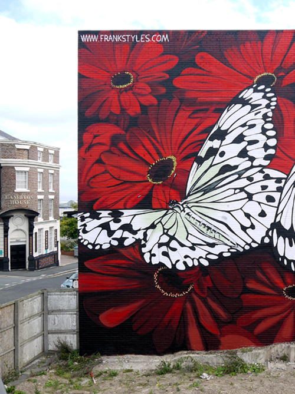

# frankstyles-AR

A quick demo of the capabilities of AR for Frank.

Visiting the app and then pointing the camera towards the painting located in Hendon, Sunderland should make butterlfies appear on screen.

This can be tested without visiting the site b pointing the camera at the photo of the real painting on his website.

To test:

On a Desktop:
Navigate to Franks website
https://www.frankstyles.com/

On your Mobile:
Navigate to POC app
https://frankstyles.herokuapp.com/
(Make sure its https and accept to allow access to camera and orientation)

With the camera open on the mobile hover it over the photo of the panting:

Hopefully you'll be presented with a little AR surprise.

